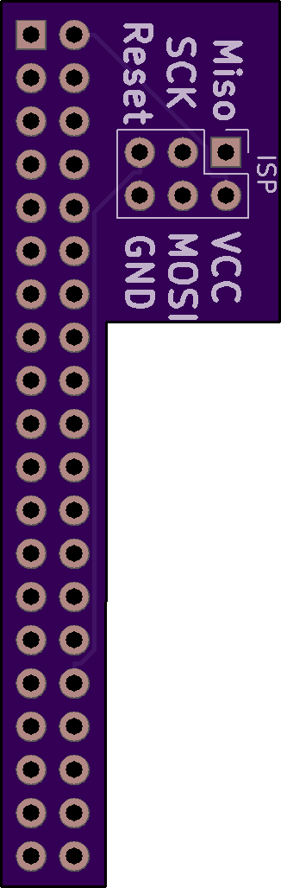
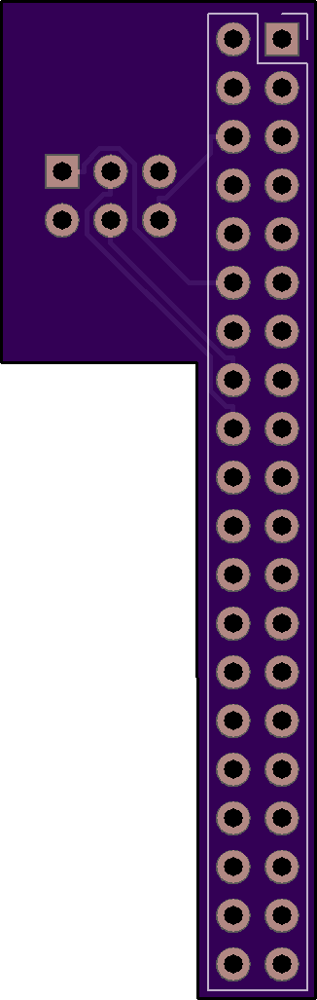

# A board and some instructions on how to use avrdude to program stuff using isp on a raspberry pi

[Purchase on OSHPARK](https://oshpark.com/shared_projects/czvLGh7R)

# Instructions

**Installing:**

```
sudo apt update
sudo apt install avrdude git
git clone https://github.com/HDR/RaspberryPi_ISP
cd RaspberryPi_ISP
cp avrdude_gpio.conf ~/avrdude_gpio.conf
```

**Usage:**

You can now use avrdude like you normally would (remember to use "-C ~/avrdude_gpi.conf -c pi_1")

Example:

```
sudo avrdude -p atmega8515 -C ~/avrdude_gpio.conf -c pi_1 -v
```


## Images






**BOM**

| Reference        | Part Number           |
| ------------- |:-------------:|
| J1 | 2x20 Female 2.54mm Header |
| J2 | 2x3 Male 2.54mm Header |

All credit on the software side goes to Tony DiCola and his guide on adafruit, you can find that [Here](https://learn.adafruit.com/program-an-avr-or-arduino-using-raspberry-pi-gpio-pins/)
